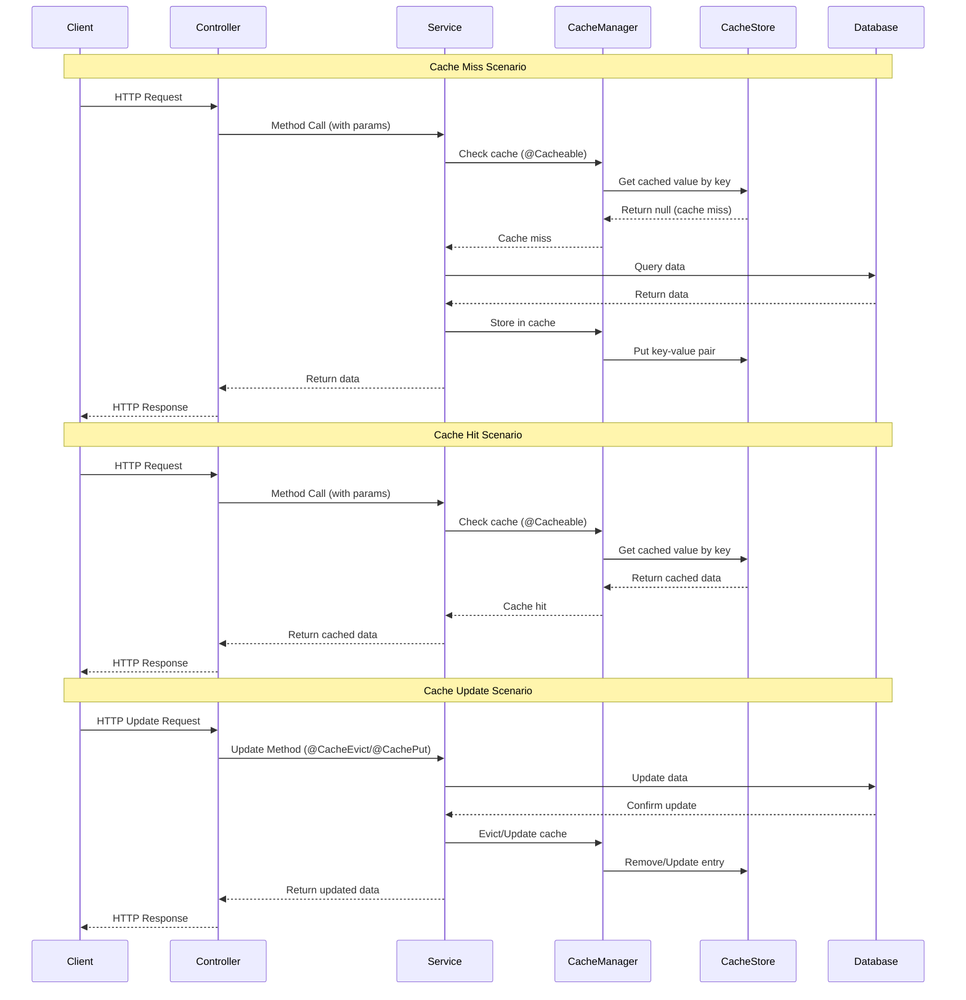
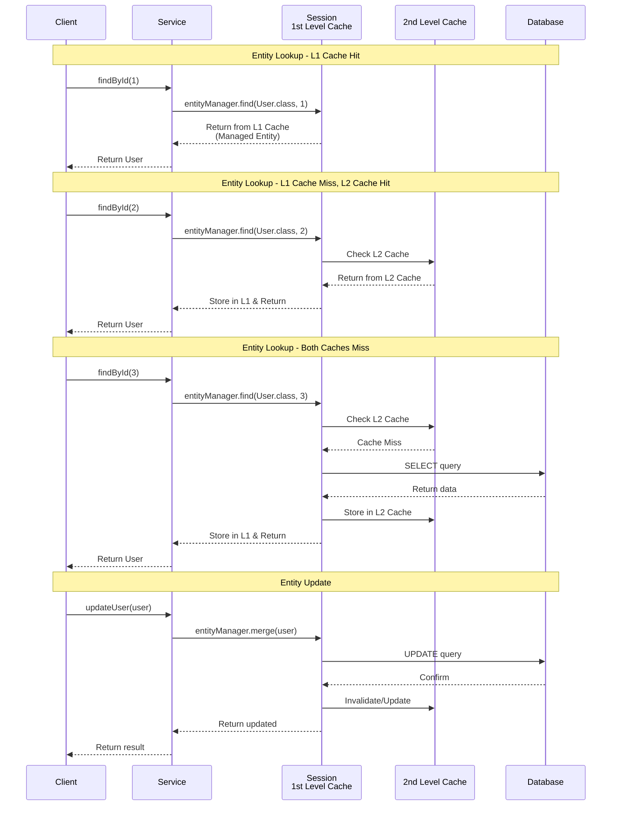

Stores frequently accessed data temporarily to speed up subsequent requests for the same data, reducing the need to fetch from slower sources like databases. 

# Method level caching
Spring provides a transparent caching abstraction primarily via **method-level caching,** enabling methods to save their results in a cache and return cached results on subsequent invocations automatically. 

Spring's caching abstraction works by intercepting method calls, checking if the result is already in the cache based on a key (often method parameters),  
- if so, returning the cached value;
- if not, it executes the method and caches the result afterward.
 
The cache can be backed by different implementations such as in-memory maps, Redis, or other stores.

## `@EnableCaching` annotation
``` Java
@SpringBootApplication
@EnableCaching
public class CachingApplication {
    public static void main(String[] args) {
        SpringApplication.run(CachingApplication.class, args);
    }
} 
```
## `@Cacheable` annotation
Caches the result of a method, skipping the method execution on subsequent calls with the same parameters.
```Java
@Cacheable("books") 
public Book getByIsbn(String isbn) { 
	// Simulate slow database call 
	simulateSlowService(); 
	return new Book(isbn, "Some book"); 
}
```

## `@CachePut` annotation
Updates the cache without skipping the method execution, useful to keep cache updated on data changes.
``` Java
@CachePut(value = "books", key = "#isbn")
public Book updateBook(String isbn, Book book) {
    // Update logic here
    return bookRepository.save(book);
}
```
    
## `@CacheEvict` annotation
Removes cache entries, useful for cache invalidation when data changes.

``` Java
@CacheEvict(value = "books", key = "#isbn")
public void deleteBook(String isbn) {
    bookRepository.deleteByIsbn(isbn);
}

```
## `@Caching` annotation 
Groups multiple cache operations

``` java
    @Caching(
        put = { // Update the cached entity
            @CachePut(key = "#result.id")
        },
        evict = { // Evict other cached entries
            @CacheEvict(key = "'email_lookup:' + #result.email"),
            @CacheEvict(key = "'username_lookup:' + #result.username"),
            @CacheEvict(cacheNames = "user_reports", key = "#result.id"),
            @CacheEvict(key = "'user_profile:' + #result.id")
        }
    )
    public User updateUser(Long userId, UserUpdateRequest request) {
```
## `@CacheConfig` annotation
Shared cache configuration at class level
``` java
  @Service 
  @CacheConfig(cacheNames = "userServices") // Different cache namespace 
  @Transactional 
  public class UserService { ...}
```




``` properties
spring.cache.type=redis
spring.data.redis.host=localhost
spring.data.redis.port=6379
spring.data.redis.password=  # Optional
spring.cache.redis.time-to-live=600s  # Default TTL for all entries
spring.cache.redis.cache-null-values=false  # Avoid caching nulls

```

# Hibernate caching layers
- **First-Level Cache (Local Cache):** A fast, in-memory cache (e.g., Caffeine or Ehcache) local to the application instance. It allows extremely quick access but is limited to the instance's memory and does not share cache across instances. T
- his is _**enabled by default** and works in **Session scope**_.
    
- **Second-Level Cache (Distributed Cache):** A shared, networked cache system (e.g., Redis, Memcached) that all application instances access. It ensures cache consistency across distributed deployments but with slightly higher access latency than local cache.




> [!todo] Research
> What are different cache providers? and when to use each?

> [!todo] Implementation
> 1- Try to pull a Redis image on docker, and connect it to your spring app. 
> 2- Setup some `@cacheable` annotations and run them
> 3- Query in Redis terminal to check if anything was cached 
# References
> [!quote]
>```embed
title: "Guide to Hibernate Second Level Cache"
image: "https://howtodoinjava.com/wp-content/uploads/2014/09/hibernate-logo.png"
description: "The hibernate second-level cache is separate from the first-level cache and is available to be used globally in SessionFactory scope."
url: "https://howtodoinjava.com/hibernate/how-hibernate-second-level-cache-works/"
favicon: ""
aspectRatio: "69"
>```

#core 